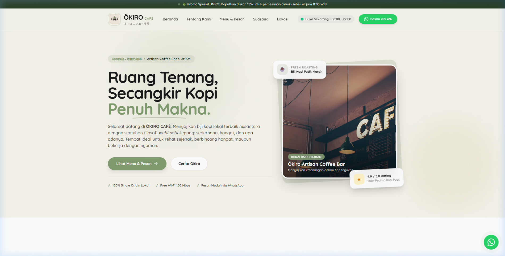
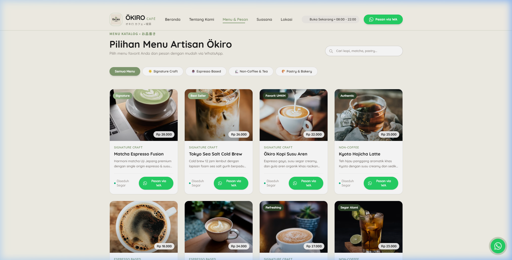

# ☕ ÖKIRO CAFÉ — Website Company Profile & Interactive Catalog

<div align="center">
  
  <br />
  <p><strong>Ruang Tenang, Secangkir Kopi Penuh Makna.</strong><br />
  <em>オキロ カフェ • 和の静寂 • 喫茶</em></p>
  <p>Website UMKM Company Profile & Katalog Menu Interaktif untuk kedai kopi artisan bernuansa Japanese-Minimalist, Clean, & Warm dengan pemesanan langsung via WhatsApp.</p>
</div>

---

## 📸 Preview Website

### 1. Hero Section & Navigasi


### 2. Katalog Menu & Pemesanan WhatsApp


---

## 🌿 Filosofi & Konsep Desain

Website ini dibangun berlandaskan panduan **`design.md`** dengan tema **Japanese-Minimalist, Clean, & Warm**:

* **Off-White / Krem Pastel (`#F6F4EB`):** Memberikan kesan ruang yang hangat, bersih, tenang, dan lapang.
* **Sage Green (`#829C71`):** Aksen utama brand untuk tombol CTA, badge sorotan, dan elemen visual.
* **Dark Forest Green (`#2C4027`):** Aksen sekunder untuk efek hover tombol dan penekanan kontras.
* **Charcoal Pekat (`#1A1A1A`):** Warna teks heading dan isi untuk keterbacaan tinggi.
* **Tipografi:** Google Fonts **Quicksand** (rounded & friendly) dipadu dengan **Noto Sans JP** (aksen tipografi Jepang).

---

## ✨ Fitur Utama

1. **Brand Identity & Animasi Steam:** Logo resmi Ökiro terintegrasi dengan efek uap mengepul halus (*coffee steam animation*) pada cangkir kopi.
2. **Katalog Menu Interaktif:**
   - Filter Kategori: *Semua Menu*, *Signature Craft*, *Espresso Based*, *Non-Coffee & Tea*, *Pastry & Bakery*.
   - Fitur **Live Search** cepat untuk mencari nama menu atau bahan minuman.
3. **Pemesanan Instan via WhatsApp:**
   - Tombol **"Pesan via WA"** pada setiap produk langsung membuka WhatsApp dengan format pesan otomatis (nama menu, harga, dan salam ramah).
   - Tombol CTA pemesanan di navbar desktop dan mobile.
4. **Animasi Dinamis & Interaktif:**
   - **Scroll-Reveal Animations:** Elemen muncul halus berjenjang (*staggered*) saat halaman digulir.
   - **Dynamic Counter:** Angka statistik toko (100% Biji Lokal, 4.9 Rating, 20+ Menu, 100 Mbps) berputar naik otomatis saat masuk layar.
   - **Floating Ambient Elements:** Kartu rating dan roasting biji kopi melayang halus.
   - **Pulsing Radar Ring:** Indikator toko buka dan floating quick WhatsApp button di pojok kanan bawah.
5. **Showcase Fasilitas & Suasana WFC:** Highlight Wi-Fi 100 Mbps, stopkontak tiap meja, ruangan AC bebas rokok, dan outdoor garden.
6. **Ulasan Pelanggan & Info Kedai:** Testimoni pelanggan nyata, jam operasional aktif, serta integrasi peta Google Maps.

---

## 🛠️ Tech Stack

* **Markup:** HTML5 Semantik
* **Styling:** Tailwind CSS (via CDN) & Custom CSS Keyframe Animations (`css/style.css`)
* **Logic / Interactivity:** Vanilla JavaScript murni (`js/app.js`)
* **Typography:** Google Fonts (`Quicksand`, `Noto Sans JP`)
* **Deployment Ready:** Vercel / GitHub Pages / Netlify (Zero Configuration Static Site)

---

## 📁 Struktur Folder

```text
Okiro/
├── css/
│   └── style.css                 # Custom keyframe animations, steam, pulse, scrollbars
├── js/
│   └── app.js                    # Menu database, category filter, live search, WA generator
├── Pastel Minimalist Cafe Logo.png # Logo resmi brand Ökiro
├── preview-hero.png              # Tangkapan layar Hero section
├── preview-menu.png              # Tangkapan layar Katalog menu
├── index.html                    # Halaman landing page utama
├── README.md                     # Dokumentasi proyek
├── prd.md                        # Product Requirements Document
└── design.md                     # Design System & Guidelines
```

---

<div align="center">
  <p>© 2026 <strong>ÖKIRO CAFÉ</strong>. Dibuat dengan cinta & dedikasi kopi nusantara.</p>
</div>
